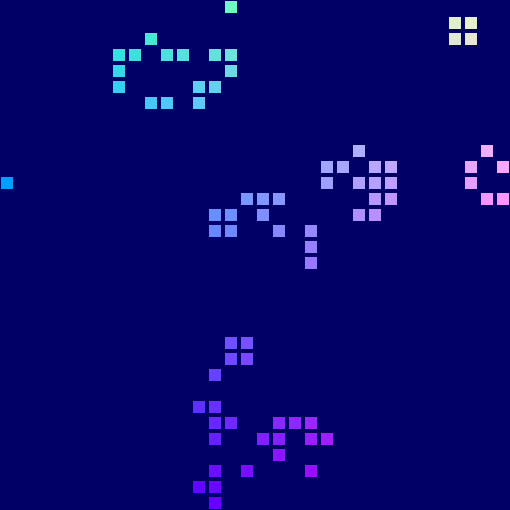

# webgpu-playground
experiments with WebGPU, Msdf, and to a lesser extent, WebGL

## Resources: 

First WebGPU App
https://codelabs.developers.google.com/your-first-webgpu-app

WebGPU Fundamentals
https://webgpufundamentals.org/

WebGPU Samples
https://webgpu.github.io/webgpu-samples/

MSDF Sample
https://webgpu.github.io/webgpu-samples/?sample=textRenderingMsdf

MSDF effects in WebGL
https://www.redblobgames.com/x/2404-distance-field-effects/